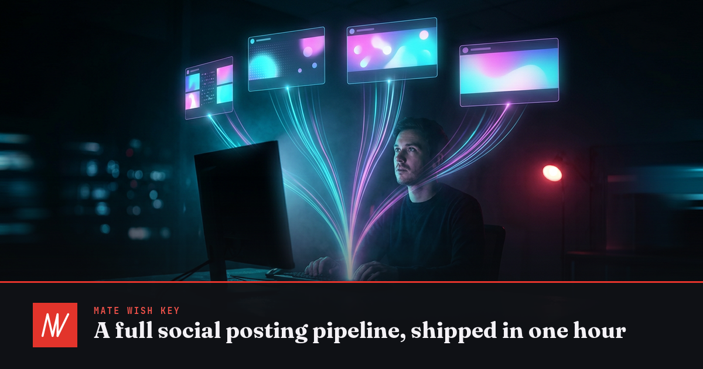

# mwk-social

A complete cross-platform social posting pipeline — **shipped in one hour**, driven
entirely from the terminal with the [Zernio](https://zernio.com) CLI.



## What this is

One CLI, one API, five connected accounts at launch (Facebook Page, LinkedIn
personal + company, Instagram, YouTube — TikTok joined since). The launch announcement went out to four platforms
at once, straight from a shell — these are the actual live posts:

- Facebook: <https://www.facebook.com/1218437048021839_122107644951415959>
- LinkedIn: <https://www.linkedin.com/feed/update/urn:li:share:7494047885701853184/>
- Instagram: <https://www.instagram.com/p/DcBmp3tCNXN/>
- YouTube: <https://www.youtube.com/watch?v=57AbTXfNguQ>

## What's inside

- `assets/og-card.png` — the AI-rendered launch card (1200×630), generated with
  [mwk-og-image-generator](https://github.com/matewishkey/mwk-og-image-generator)
  and branded by code.
- `assets/` — also holds the ImageMagick announcement card (1080×1080), wide
  version (1920×1080) and the 10s launch video.
- `scripts/generate-assets.sh` — regenerates the three ImageMagick/ffmpeg assets
  (the AI og-card comes from mwk-og-image-generator).
- `scripts/post.js` — publishes to any set of connected accounts and attaches the
  standard first comment natively, so it lands seconds after the post does.
- `scripts/post-everywhere.sh` — the original one-liner entry point, now a thin
  wrapper over `post.js`.
- `config/voice.json` — everything the pipeline says out loud: the rotating first-comment
  variants, the identity and brand tags, per-platform hashtag caps, the tag blocklist and the
  YouTube show blurb. One file to change what gets posted.
- `scripts/first-comment.js` — makes sure everything published has its comment.
  Facebook, Instagram, LinkedIn and YouTube get it natively at publish time;
  Threads has no such field, so this picks it up. TikTok and X have no usable
  comments API at all. The wording rotates, and some comments quote a real guest
  wish from the show's feed.
- `docs/playbook.md` — the rules this pipeline runs on, and what each platform
  will and won't allow.
- `scripts/lib/media.js` — probes a clip's duration, aspect, codec and audio,
  and says which platforms will take it. The queue checks this before publishing:
  a video Instagram or TikTok would reject costs the post otherwise.
- `scripts/lib/topic-tags.js` — works out what a video was about so the comment
  can say so. Downloads the clip, strips the audio with ffmpeg, transcribes it,
  and names the subjects it covers — `#Debugging`, `#Trading`, whatever the clip
  is actually about, never audience or marketing tags. Needs `OPENAI_API_KEY`
  and `GEMINI_API_KEY`; without them the comment still goes out, just untagged.
  Results are cached per post under `~/.local/state/mwk-social/topics/`.
- `web/` — the dashboard on Cloudflare Workers + D1, behind an email one-time
  PIN at `social.matewishkey.com`. Five pages: what the pipeline has been doing
  and what needs a human, the stats, the queue, YouTube show notes awaiting
  approval, and a workflow map of what happens on each platform. Fed by
  `scripts/ship-events.js` (every two minutes) and `scripts/ship-stats.js`
  (hourly).
- **Everything publishes from here.** The pipeline used to also mirror reels
  that Restream had put on Facebook, and carried a whole matcher to work out
  whether a copy was already on a platform before posting another. That is gone:
  the queue is the only way content goes out, so there is nothing to reconcile
  against and nothing to guess about. Anything posted outside it is a one-off,
  handled by hand.
- `scripts/lib/pace.js` — the one thing that decides *when* anything goes out:
  the posting window in the audience's timezone, the daily cap, the minimum gap.
  Everything that publishes asks it, so queueing five things at once produces
  five posts spread over hours rather than five posts in a minute.
- `scripts/run-queue.js` — takes one item off the dashboard queue and posts it,
  if now is a good moment. Claims before publishing, and puts an item back
  rather than burning it when something goes wrong.
- `scripts/lib/shortlink.js` — mints the `mwkshow.com/<code>` link that every
  call to action carries, one code per platform and post, so a click says which
  channel and which clip earned it. Idempotent, and never fatal: with no
  dashboard the plain URL goes out and the comment still happens.
- `scripts/lib/reshare.js` — LinkedIn quote-reshare. The company page posts it,
  the personal account shares it with a thought on top — his words, supplied
  with the queued post, never generated.
- `scripts/yt-description.js` — writes YouTube descriptions from each video's own
  transcript. `--sync` fills in videos that have none and files a *proposal* for
  anything that already has a description, which does nothing until it is
  approved on the dashboard.
- `scripts/install-timers.sh` — installs the five systemd `--user` timers: the
  comment check hourly, the queue hourly, the event uploader every two minutes,
  analytics hourly, and the show-notes draft daily. The posting *pace* lives in
  `lib/pace.js`, not the timers.

## Reproduce it

```bash
npm install                      # installs @zernio/cli locally
./node_modules/.bin/zernio auth:login    # device flow
./node_modules/.bin/zernio connect:get-url facebook --profileId <your-profile-id>
./node_modules/.bin/zernio connect:get-url linkedin --profileId <your-profile-id>
# open the printed URLs, authorize, then:
./node_modules/.bin/zernio accounts:list # grab your account IDs

scripts/generate-assets.sh
export ZERNIO_IMAGE_ACCOUNTS=<id1>,<id2>
scripts/post-everywhere.sh "Your announcement text" assets/ship-card.png
```

## What's worth measuring

At this size, followers are not the scoreboard — five of the eight connected
channels are still in single digits, and one (LinkedIn personal) holds almost
all of the audience. The stats page is built around five things
instead, in this order:

1. **reach / views** — did anyone see it
2. **engagement rate** — did anyone care, normalised so it survives growth
3. **link clicks** — the only number tied to the actual goal, guest sign-ups
4. **cadence** — posts per week, the biggest lever fully within our control
5. **follower growth** — last, and only where there is a base to grow

Each channel card shows only the metrics that channel genuinely returns,
measured across live posts rather than read off a docs page. Facebook reports
clicks; Instagram, YouTube, TikTok, Threads and X report zero on every post,
which is exactly why the CTA has its own short domain.

## Platform notes (the ones that bite)

- **Facebook posts to Pages only** — no API on earth can post to a personal
  timeline; that's Meta's rule, not Zernio's.
- **Instagram needs a Business/Creator account**, and every post needs media.
- **LinkedIn** rejects duplicate content (422) and caps posts at 3,000 chars.
  Reshare an existing post via `platformSpecificData.reshareUrl` (quote-repost
  when you add text).
- **YouTube** posts are video uploads — `--title` + `--media <video url>`.
- **Comment APIs take the platform's native post ID**, not the Zernio one — read
  it from `platforms[].platformPostId`, or every `inbox:*` call 404s.
- **First comments are a native field**, `platformSpecificData.firstComment`, on
  Facebook, Instagram, LinkedIn and YouTube — but not TikTok, and not from the
  CLI, so `post.js` calls the REST API directly.
- **Posts made in the apps show up on a delay** — the external-post sync runs
  roughly every 90 minutes, so the catch-all comment lands within about that.
- **YouTube won't take comments on a private video** — the API 403s and a
  `firstComment` never appears. Unlisted works fine.
- **Instagram can't be deleted or edited through any API.** Every mistake there
  is permanent, so a clip is checked against its limits before anything is sent.
- **Instagram's 5-hashtag cap counts the caption and the comments together.** So
  the caption carries none and the first comment spends all five — two always-on
  tags and three describing the clip.
- **TikTok's settings go in `tiktokSettings` at the top level** of the request,
  not in `platformSpecificData` — which would look accepted and silently apply
  none of them, because that field stores and echoes any key you send it.

The full set, with the story behind each, is in [docs/playbook.md](docs/playbook.md).
