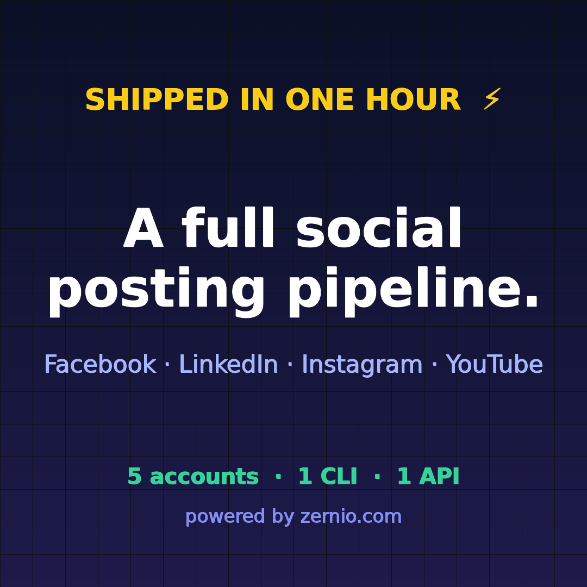

# mwk-social

A complete cross-platform social posting pipeline — **shipped in one hour**, driven
entirely from the terminal with the [Zernio](https://zernio.com) CLI.



## What this is

One CLI, one API, five connected accounts (Facebook Page, LinkedIn personal +
company, Instagram, YouTube). The launch announcement went out to four platforms
at once, straight from a shell — these are the actual live posts:

- Facebook: <https://www.facebook.com/1218437048021839_122107642599415959>
- LinkedIn: <https://www.linkedin.com/feed/update/urn:li:share:7494043502444535808/>
- Instagram: <https://www.instagram.com/p/DcBkopZiGdj/>
- YouTube: <https://www.youtube.com/watch?v=57AbTXfNguQ>

## What's inside

- `assets/` — the announcement card (1080×1080), wide/OG version (1920×1080) and
  the 10s launch video, all generated locally with ImageMagick + ffmpeg.
- `scripts/generate-assets.sh` — regenerates all three assets from scratch.
- `scripts/post-everywhere.sh` — uploads media and posts to any set of connected
  accounts in one go.

## Reproduce it

```bash
npm install                      # installs @zernio/cli locally
./node_modules/.bin/zernio auth:login    # device flow, free for 2 accounts
./node_modules/.bin/zernio connect:get-url facebook --profileId <your-profile-id>
./node_modules/.bin/zernio connect:get-url linkedin --profileId <your-profile-id>
# open the printed URLs, authorize, then:
./node_modules/.bin/zernio accounts:list # grab your account IDs

scripts/generate-assets.sh
export ZERNIO_IMAGE_ACCOUNTS=<id1>,<id2>
scripts/post-everywhere.sh "Your announcement text" assets/ship-card.png
```

## Platform notes (the ones that bite)

- **Facebook posts to Pages only** — no API on earth can post to a personal
  timeline; that's Meta's rule, not Zernio's.
- **Instagram needs a Business/Creator account**, and every post needs media.
- **LinkedIn** rejects duplicate content (422) and caps posts at 3,000 chars.
  Reshare an existing post via `platformSpecificData.reshareUrl` (quote-repost
  when you add text).
- **YouTube** posts are video uploads — `--title` + `--media <video url>`.
